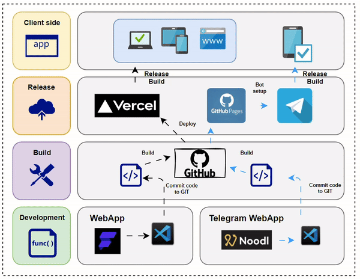
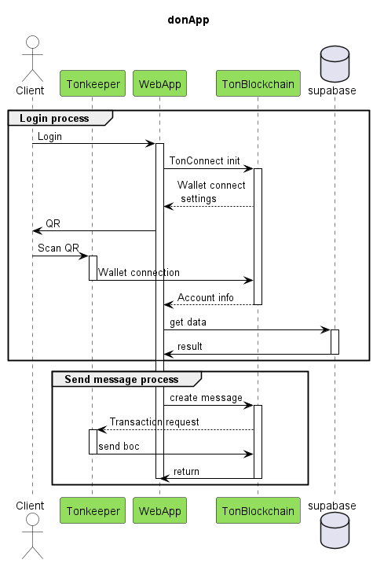
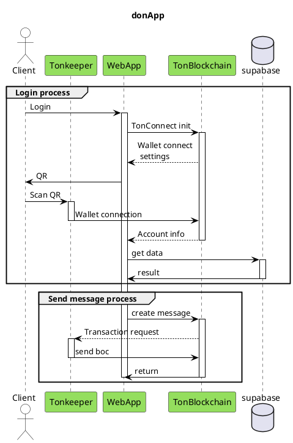
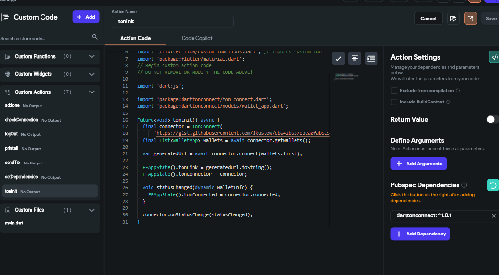
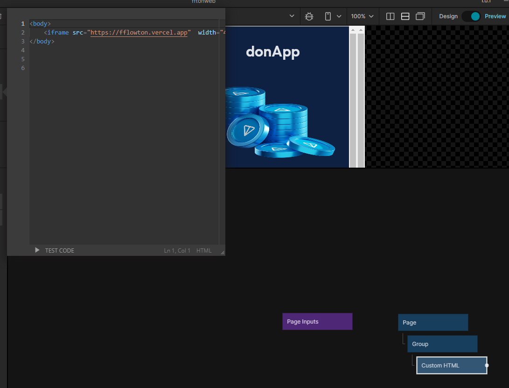
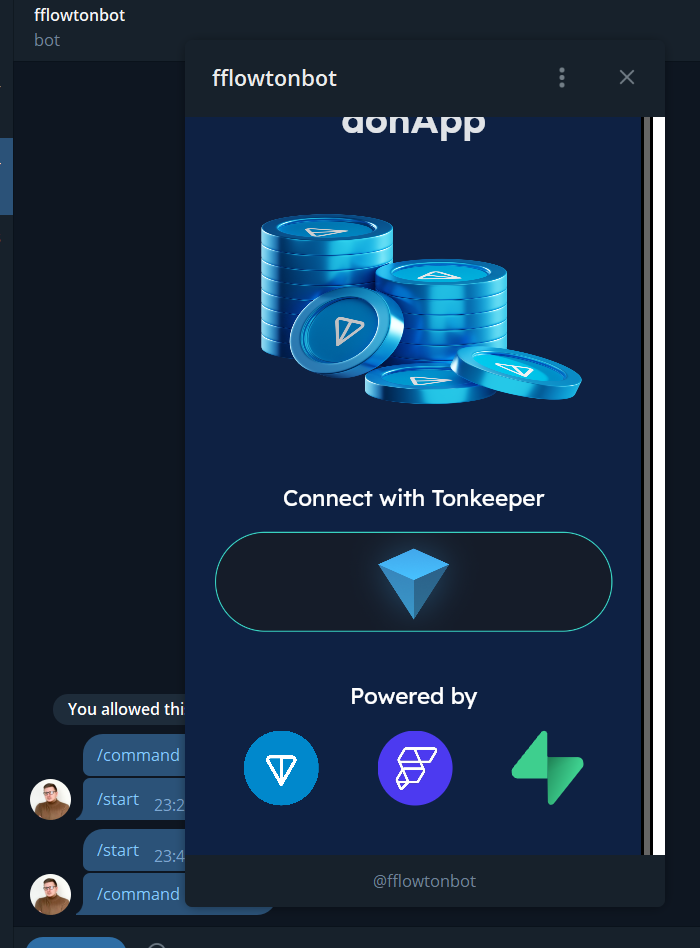

# Description

Current project is created using the low-code platform Flutterflow and libraries for integration with the TON blockchain.


The source code was also imported using Flutterflow's built-in tools and built for Flutter web, after which it was deployed to Versel hosting.

| Aspect                 | Tool           |
|------------------------|----------------|
| Development            | Flutterflow    |
| Custom code            | Dart           |
| Blockchain integration | TonConnect     |
| Dart library           | DartTonConnect |
| Wallet                 | TonKeeper      |
| Backend                | Supabase       |

### Demo


# Deploy process


# User stories

1. **Login to the Application**

As a user, I want to log in to the application using my Tonkeeper wallet so that I can make a donation transaction.

| Step | Participants | Action                                                       | Result                                                                                      |
|------|--------------|--------------------------------------------------------------|---------------------------------------------------------------------------------------------|
| 1    | Client | User logs into the application through the client interface. | -                                                                                           |
| 2    | WebApp, Blockchain | WebApp initiates the TonConnect process for login.           | Blockchain returns authorization link                                                       |
| 3    | Blockchain, Tonkeeper | TonConnect establishes a connection with the wallet.         | Blockchain returns account data, wallet address is saved                                    |
| 4    | WebApp, Supabase | WebApp retrieves donate options from Supabase.          | The user successfully logs into the application and gains access to their donation options. |

2. **Sending a transaction**

As a user, I want to make a donation through my wallet on the TON blockchain.

| Step | Participants | Action | Result                                                                |
|------|--------------|--------|-----------------------------------------------------------------------|
| 1    | Client | User creates a message through the application's client interface. | -                                                                     |
| 2    | WebApp, Blockchain | WebApp sends a request to Blockchain to create the message. | The client receives a push notification about the transaction         |
| 3    | Client, Tonkeeper | The client confirms the transaction in the wallet| BOC message is generated                                              |
| 4    | Blockchain, Tonkeeper | The wallet sends a BOC with transaction data to Blockchain. | The transaction is recorded in the blockchain                         |
| 5    | Blockchain, WebApp | Blockchain completes the message creation process and returns the result to WebApp. | The message is successfully created and sent through the application. |

# Sequence diagram


<details>

<summary>Plant UML</summary>



</details>

# Custom code
Custom code was used to write integration with the TonKeeper wallet and blockchain integration. Additionally, custom code was used for the code responsible for sending transactions.



### Init connection
```dart
// Automatic FlutterFlow imports
import '/backend/supabase/supabase.dart';
import '/flutter_flow/flutter_flow_theme.dart';
import '/flutter_flow/flutter_flow_util.dart';
import '/custom_code/actions/index.dart'; // Imports other custom actions
import '/flutter_flow/custom_functions.dart'; // Imports custom functions
import 'package:flutter/material.dart';
// Begin custom action code
// DO NOT REMOVE OR MODIFY THE CODE ABOVE!

import 'dart:js';

import 'package:darttonconnect/ton_connect.dart';
import 'package:darttonconnect/models/wallet_app.dart';

Future<void> toninit() async {
  final connector = TonConnect(
      '..../gistfile1.txt');
  final List<WalletApp> wallets = await connector.getWallets();

  var generatedUrl = await connector.connect(wallets.first);

  FFAppState().tonLink = generatedUrl.toString();
  FFAppState().tonConnector = connector;

  void statusChanged(dynamic walletInfo) {
    FFAppState().tonConnected = connector.connected;
  }

  connector.onStatusChange(statusChanged);
}
```
### Send transaction
```dart
// Automatic FlutterFlow imports
import '/backend/supabase/supabase.dart';
import '/flutter_flow/flutter_flow_theme.dart';
import '/flutter_flow/flutter_flow_util.dart';
import '/custom_code/actions/index.dart'; // Imports other custom actions
import '/flutter_flow/custom_functions.dart'; // Imports custom functions
import 'package:flutter/material.dart';
// Begin custom action code
// DO NOT REMOVE OR MODIFY THE CODE ABOVE!

import 'package:darttonconnect/exceptions.dart';
import 'package:darttonconnect/logger.dart';

Future sendTrx(String link, int value) async {
  print(value);
  final stringValue = value.toString();
  print(stringValue);
  var transaction = {
    "validUntil": 1718097354,
    "messages": [
      {
        "address": link,
        "amount": stringValue,
      }
    ]
  };
  print(FFAppState().tonConnector.wallet);
  try {
    await FFAppState().tonConnector.sendTransaction(transaction);
  } catch (e) {
    if (e is UserRejectsError) {
      logger.d(
          'You rejected the transaction. Please confirm it to send to the blockchain');
      print(
          'You rejected the transaction. Please confirm it to send to the blockchain');
    } else {
      logger.d('Unknown error happened $e');
      print('Unknown error happened');
    }
  }
}
```

# TWA

Additionally, the application was integrated into a Telegram bot. For this purpose, the No-Code builder Noodl was also used. Specifically, this builder allows generating React applications that are required for publication within the Telegram bot.

The React application utilizes an iframe, which contains a link to the website that is then opened within Telegram.

<div style="display: flex; justify-content: space-around;">
    
    
</div>

## My contacts
- [Telegram](https://t.me/ikustow)
- [Linkedin](https://www.linkedin.com/in/ikustow/)
- [Email](mailto:ikustov.dev@gmail.com)
